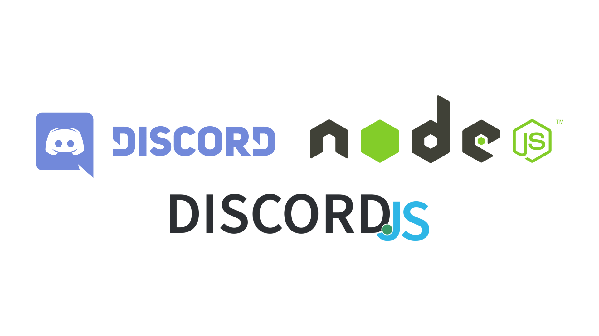

[](https://www.codacy.com/gh/nejdetkadir/discord-music-player/dashboard?utm_source=github.com&amp;utm_medium=referral&amp;utm_content=nejdetkadir/discord-music-player&amp;utm_campaign=Badge_Grade)

# Discord Music Player Bot

Sample music player bot for Discord

## Usage
Commands
- play (play video with youtube url)
- search (search video from youtube by name)
- disc / disconnect (disconnect from channel)

## Preview
You can watch preview from [here](https://www.youtube.com/watch?v=DH_2qF1NW6k)

### Examples
I will use '!' as default prefix
  - Play command
    - !play https://www.youtube.com/watch?v=7fYi_tYZhnY
  - Search command
    - !search patron sagopa siyah
  - Disconnect command
    - !disc or !disconnect
## Build Setup
install dependencies
```bash
$ npm install
```

### Environment variables
Create a file named ".env" in the root directory and fill its contents as follows
```dotenv
TOKEN=XXX
PREFIX=XXX
```

start with nodemon
```bash
$ npm run start:dev
```
## Useful links
- https://discord.js.org/#/docs/main/stable/general/welcome
- https://discord.com/developers/docs/intro

# LICENSE
```
MIT License

Copyright (c) 2021 Nejdet Kadir Bektaş

Permission is hereby granted, free of charge, to any person obtaining a copy
of this software and associated documentation files (the "Software"), to deal
in the Software without restriction, including without limitation the rights
to use, copy, modify, merge, publish, distribute, sublicense, and/or sell
copies of the Software, and to permit persons to whom the Software is
furnished to do so, subject to the following conditions:

The above copyright notice and this permission notice shall be included in all
copies or substantial portions of the Software.

THE SOFTWARE IS PROVIDED "AS IS", WITHOUT WARRANTY OF ANY KIND, EXPRESS OR
IMPLIED, INCLUDING BUT NOT LIMITED TO THE WARRANTIES OF MERCHANTABILITY,
FITNESS FOR A PARTICULAR PURPOSE AND NONINFRINGEMENT. IN NO EVENT SHALL THE
AUTHORS OR COPYRIGHT HOLDERS BE LIABLE FOR ANY CLAIM, DAMAGES OR OTHER
LIABILITY, WHETHER IN AN ACTION OF CONTRACT, TORT OR OTHERWISE, ARISING FROM,
OUT OF OR IN CONNECTION WITH THE SOFTWARE OR THE USE OR OTHER DEALINGS IN THE
SOFTWARE.
```